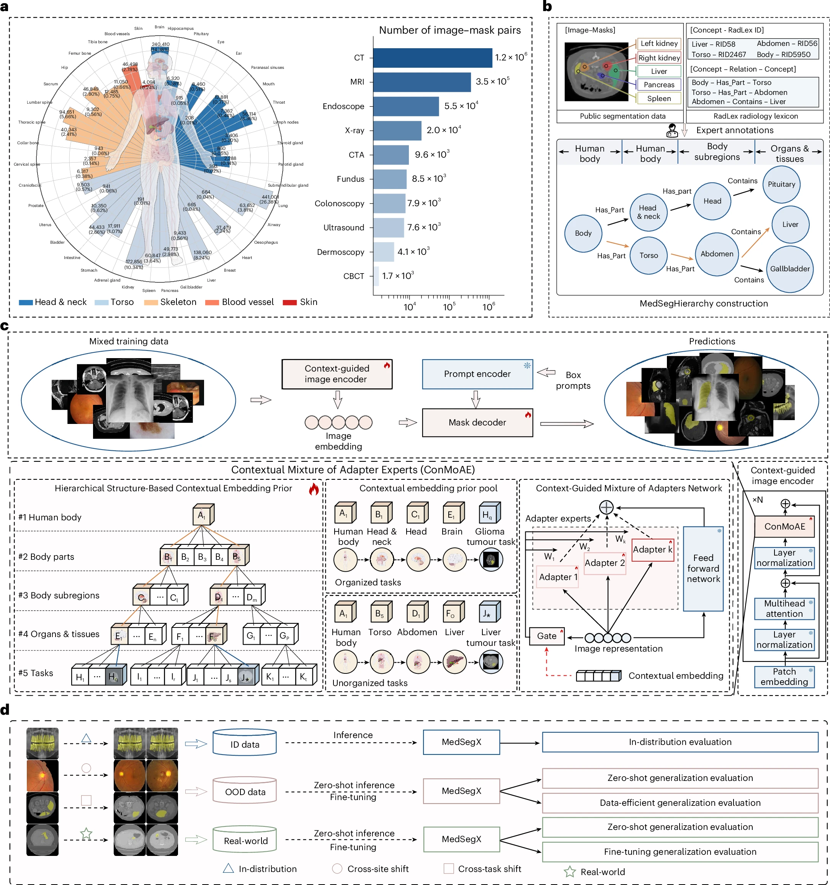

# 🩻 MedSegX - Open-World Medical Image Segmentation Foundation Model and Database

### A generalist foundation model and database for open-world medical image segmentation

Siqi Zhang*, Qizhe Zhang*, Shanghang Zhang*†, Xiaohong Liu*, Jingkun Yue*, Ming Lu, Huihuan Xu, Jiaxin Yao, Xiaobao Wei, Jiajun Cao, Xiang Zhang, Ming Gao, Jun Shen, Yichang Hao, Yinkui Wang, Xingcai Zhang, Song Wu, Ping Zhang, Shuguang Cui & Guangyu Wang† (*Equal Contribution, †Corresponding Author)

[Nature Biomedical Engineering (2025)](https://www.nature.com/articles/s41551-025-01497-3): https://www.nature.com/articles/s41551-025-01497-3

*Lead Contact: Prof. Guangyu Wang, Prof. Shanghang Zhang.*

#### Abstract

<p align="justify">
Vision foundation models have demonstrated vast potential in achieving generalist medical segmentation capability, providing a versatile, task-agnostic solution through a single model. However, current generalist models involve simple pre-training on various medical data containing irrelevant information, often resulting in the negative transfer phenomenon and degenerated performance. Furthermore, the practical applicability of foundation models across diverse open-world scenarios, especially in out-of-distribution (OOD) settings, has not been extensively evaluated. Here we construct a publicly accessible database, MedSegDB, based on a tree-structured hierarchy and annotated from 129 public medical segmentation repositories and 5 in-house datasets. We further propose a Generalist Medical Segmentation model (MedSegX), a vision foundation model trained with a model-agnostic Contextual Mixture of Adapter Experts (ConMoAE) for open-world segmentation. We conduct a comprehensive evaluation of MedSegX across a range of medical segmentation tasks. Experimental results indicate that MedSegX achieves state-of-the-art performance across various modalities and organ systems in in-distribution (ID) settings. In OOD and real-world clinical settings, MedSegX consistently maintains its performance in both zero-shot and data-efficient generalization, outperforming other foundation models.
</p>



## 📰 News

🔥 **[2025/09/05]** Our paper is available [online](https://www.nature.com/articles/s41551-025-01497-3)!

🔥 **[2025/08/05]** Our paper is accepted by Nature Biomedical Engineering!

## ⚙️ Setup

### 🏝️ Environment

1. Clone this repository.
```bash
git clone https://github.com/MedSegX/MedSegX-code.git MedSegX
cd MedSegX
```

2. Create a conda environment.
```bash
conda create -n medsegx python=3.10 -y
conda activate medsegx
```

3. Install necessary packages.
```bash
conda install pytorch==2.0.0 torchvision==0.15.0 pytorch-cuda=11.8 -c pytorch -c nvidia
pip install -r requirements.txt
```

### 📦️ Model

1. Download base model checkpoints from [SAM](https://github.com/facebookresearch/segment-anything#model-checkpoints):

| Model | Backbone | Checkpoint |
|----------|:----------:|:-----------:|
| SAM | ViT-B | [sam-vit-b-01ec64.pth](https://dl.fbaipublicfiles.com/segment_anything/sam_vit_b_01ec64.pth) |
| SAM | ViT-L | [sam-vit-l-0b3195.pth](https://dl.fbaipublicfiles.com/segment_anything/sam_vit_l_0b3195.pth) |
| SAM | ViT-H | [sam-vit-h-4b8939.pth](https://dl.fbaipublicfiles.com/segment_anything/sam_vit_h_4b8939.pth) |

2. Download our MedSegX checkpoint from [Google Drive](https://drive.google.com/file/d/1_lTLYQ1p0Et8GGgUNJWzONVSc6RwbRGe/view?usp=share_link).

The checkpoints should be placed in the `./playground` directory, with the following structure:
```
playground/
├── SAM/
│   ├── sam_vit_b_01ec64.pth
│   ├── sam_vit_l_0b3195.pth
│   └── sam_vit_h_4b8939.pth
└── MedSegX/
    └── medsegx_vit_b.pth
```

### 📊 Data

We provide an [example dataset](playground/example_data.zip) to help users get started with MedSegX quickly. This example dataset has already been organized according to the complete MedSegDB structure. You only need to unzip it to the `./playground` directory. Then, you can directly go to the [Quick Start](#-quick-start) section to perform a fast inference.

Our MedSegDB are curated from open-source medical segmentation datasets, which can be accessed via the weblinks provided in [Supplementary Table 1](https://static-content.springer.com/esm/art%3A10.1038%2Fs41551-025-01497-3/MediaObjects/41551_2025_1497_MOESM1_ESM.pdf). Among them, the datasets that permit redistribution are available on [HuggingFace](https://huggingface.co/datasets/medicalai/MedSegDB), where the data is fully preprocessed and can be used out of the box without any further processing.

The whole MedSegDB should be placed in the `./playground` directory and organized in the following structure:
```
playground/
└── MedSegDB/
    ├── train/
    └── eval/
        ├── ID/
        ├── OOD/
        │   ├── cross_site/
        │   └── cross_task/
        └── RealWorld/
            ├── cross_site/
            └── cross_task/
```

For more details about data structure of MedSegDB, please see [DATA.md](docs/DATA.md).

## 🛠️ Usage

### 🚀 Quick Start

After preparing the model weights and example dataset, you can easily use the [`quick-start.sh`](scripts/quick-start.sh) to perform inference with MedSegX. For example, if you want to conduct an ID evaluation, you can run the following command:
```bash
python evaluate_internal.py \
    --checkpoint ./playground/SAM \
    --model_type vit_b \
    --model_weight ./playground/MedSegX/medsegx_vit_b.pth \
    --data_path ./playground/MedSegDB-example/eval/ID \
    --metric dsc hd \
    --device_ids 0 \
    --batch_size 32
```

After running the above script, the results will be saved in the `./playground/MedSegX` directory. We also provide [example results](playground/MedSegX/example_results.zip) for double-checking.

### 🏗️ Training

After preparing MedSegDB according to [DATA.md](docs/DATA.md), you can use the following command to train MedSegX:
```bash
python pretrain.py \
    --checkpoint ./playground/SAM \
    --model_type vit_b \
    --data_path ./playground/MedSegDB \
    --device_ids 0 1 2 3 4 5 6 7 \
    --num_epochs 30 \
    --batch_size 1024 \
    --lr 1e-3 \
    --use_amp
```

This command trains MedSegX on 8 GPUs by default, with the batch size of 1024, requiring at least 40GB memory for each GPU. You can set the `device_ids` and `batch_size` arguments for different machine. For example, if you want to train MedSegX on 4 GPUs, you can use the following command:
```bash
python pretrain.py \
    --checkpoint ./playground/SAM \
    --model_type vit_b \
    --data_path ./playground/MedSegDB \
    --device_ids 0 1 2 3 \
    --num_epochs 30 \
    --batch_size 512 \
    --lr 5e-4 \
    --use_amp
```

### 🎛️ Tuning

You can further fine-tune our provided MedSegX pre-trained weight on OOD tasks to achieve better performance. For example, if you want to fine-tune on cross-site shift, you can use the following command:
```bash
python finetune.py \
    --checkpoint ./playground/SAM \
    --model_type vit_b \
    --data_path ./playground/MedSegDB/eval/OOD \
    --shift_type cross_site \
    --device_ids 0 1 2 3 4 5 6 7 \
    --num_epochs 30 \
    --batch_size 64 \
    --validation val \
    --resume ./playground/MedSegX/medsegx_vit_b.pth \
    --lr 5e-5 \
    --use_amp
```

Similarly, if you want to fine-tune on cross-task shift using a single GPU, you can use the following command:
```bash
python finetune.py \
    --checkpoint ./playground/SAM \
    --model_type vit_b \
    --data_path ./playground/MedSegDB/eval/OOD \
    --shift_type cross_task \
    --device_ids 0 \
    --num_epochs 30 \
    --batch_size 64 \
    --validation val \
    --resume ./playground/MedSegX/medsegx_vit_b.pth \
    --lr 5e-5 \
    --use_amp
```

### 🧪 Evaluation

For internal evalution, you can run the following command:
```bash
python evaluate_internal.py \
    --checkpoint ./playground/SAM \
    --model_type vit_b \
    --model_weight ./playground/MedSegX/medsegx_vit_b.pth \
    --data_path ./playground/MedSegDB/eval/ID \
    --metric dsc hd \
    --device_ids 0 1 2 3 4 5 6 7 \
    --batch_size 32
```

For external evalution with cross-site shift, you can run the following command:
```bash
python evaluate_external.py \
    --checkpoint ./playground/SAM \
    --model_type vit_b \
    --model_weight ./playground/MedSegX/medsegx_vit_b.pth \
    --data_path ./playground/MedSegDB/eval/OOD \
    --shift_type cross_site \
    --metric dsc hd \
    --device_ids 0 1 2 3 4 5 6 7 \
    --batch_size 32
```

And for external evalution with cross-task shift, you can run the following command:
```bash
python evaluate_external.py \
    --checkpoint ./playground/SAM \
    --model_type vit_b \
    --model_weight ./playground/MedSegX/medsegx_vit_b.pth \
    --data_path ./playground/MedSegDB/eval/OOD \
    --shift_type cross_task \
    --metric dsc hd \
    --device_ids 0 1 2 3 4 5 6 7 \
    --batch_size 32
```

## 🔖 Citation
If you find MedSegX useful for your research and applications, please cite using this BibTeX:
```
@article{zhang2025generalist,
  title={A generalist foundation model and database for open-world medical image segmentation},
  author={Zhang, Siqi and Zhang, Qizhe and Zhang, Shanghang and Liu, Xiaohong and Yue, Jingkun and Lu, Ming and Xu, Huihuan and Yao, Jiaxin and Wei, Xiaobao and Cao, Jiajun and others},
  journal={Nature Biomedical Engineering},
  pages={1--16},
  year={2025},
  publisher={Nature Publishing Group UK London}
}
```

Or the following plain-text version from [Nature](https://www.nature.com/articles/s41551-025-01497-3#citeas):
```
Zhang, S., Zhang, Q., Zhang, S. et al. A generalist foundation model and database for open-world medical image segmentation. Nat. Biomed. Eng (2025). https://doi.org/10.1038/s41551-025-01497-3
```

## 🎟️ License

This project is released under the [Apache 2.0 license](LICENSE).

## 🏅 Acknowledgement

We appreciate the open-source efforts of [SAM](https://github.com/facebookresearch/segment-anything) and [MedSAM](https://github.com/bowang-lab/MedSAM) teams.
